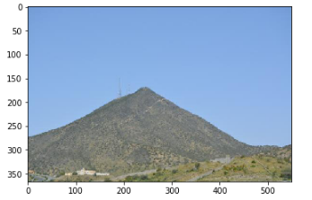

## Automatic Image Captioning

This is an Automatic Image Captioning System based on the model
architecture described by Marc Tanti, et al. in their 2017 
[paper](http://bit.ly/2YAceSm)

Performed extensive text preprocessing for this task. Used Transfer Learning with the VGG 16 CNN model. Used LSTMs for handling the text input data

Dataset used for training: Flickr8k Dataset: [link](https://illinois.edu/fb/sec/1713398)

The code is largely based on [this](https://machinelearningmastery.com/develop-a-deep-learning-caption-generation-model-in-python/) excellent tutorial.

### Some examples:

The model is not perfect, but the instances where it gets the caption
wrong are generally those where there are no/very few training instances

> Caption generated: `black dog is running through the water`

> Caption generated: `man in red shirt is riding bike on the street`

> Caption generated: `person climbing down rocky cliffside with water below`

> Caption generated: `man in blue is surfing in the water`

Some examples where the model gets the captions incorrect:

> Caption generated: `man is climbing rock face`

> Caption generated: `two dogs are racing on the track`

> Caption generated: `two children are playing in the snow`